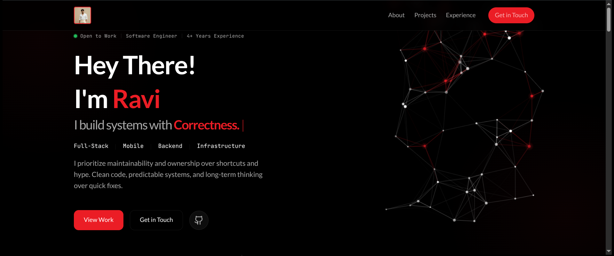

# Ravi Kovind

**Software Engineer** | Full-Stack | Mobile | Backend | Infrastructure

[](https://ravikovind.github.io)
[](https://linkedin.com/in/ravikovind)
[](https://x.com/ravi_kovind)
[](https://pub.dev/publishers/voltvave.com/packages)

---



## About

Software Engineer with 4+ years of hands-on experience designing, building, deploying, and maintaining production-grade applications. NIT Allahabad alumni.

> *I prioritize maintainability and ownership over shortcuts and hype. Clean code, predictable systems, and long-term thinking over quick fixes.*

## Highlights

| Metric | Value |
|--------|-------|
| Years of Experience | 4+ |
| Apps Built | 10+ |
| Users Served | 30K+ |
| Orders Processed | 80K+ |
| Package Downloads | 3.89K+ |

## Tech Stack

**Languages:** Dart, JavaScript, TypeScript, Python, Java, PHP

**Frameworks:** Flutter, React, Next.js, Node.js, Express, FastAPI

**Databases:** PostgreSQL, MongoDB, Redis, MySQL

**Infrastructure:** AWS, GCP, Docker, NGINX, Linux

**Tools:** Firebase, Git, GitHub, Kafka

## Featured Projects

### TingTing
Hyperlocal grocery delivery ecosystem connecting customers, stores, pickers, and delivery partners. Built complete suite of apps with real-time order tracking and ERP integration.
- 35+ Live Stores | 30K+ Users | 80K+ Orders | ₹1.5Cr+ Revenue

### MCPVave
Cross-platform MCP client that connects to MCP servers using SSE & STDIO. Works on mobile, desktop, and web.

### Tredye
Real-time trading dashboard with microservices architecture. Live market data streaming, RSI calculation, divergence detection, and news aggregation.

### Bhagavad Gita
Complete Bhagavad Gita app with all 18 chapters. 40K+ downloads, 2K daily users. Free, no ads.

## Open Source

| Package | Stats |
|---------|-------|
| [flutter_lucide](https://pub.dev/packages/flutter_lucide) | 70 likes, 3.89K downloads |
| [Bhagavad Gita](https://play.google.com/store/apps/details?id=com.gita) | 40K+ downloads, 2K/day |
| [gen-images](https://github.com/ravikovind/gen-images) | AI image generation pipeline |
| [recipe_x](https://github.com/ravikovind/recipe_x) | 45K+ recipes worldwide |

## Portfolio Features

- Interactive particle network animation
- Typing effect with dynamic words
- Horizontal scrolling tech stack timeline
- Embedded X posts (dark theme)
- Glass-morphism UI elements
- Responsive mobile-first design
- SEO optimized with structured data

## Run Locally

```bash
git clone https://github.com/ravikovind/ravikovind.github.io.git
cd ravikovind.github.io
open index.html
```

## Contact

- **Email:** hey.ravikovind@gmail.com
- **Phone:** +91 8433491441
- **LinkedIn:** [ravikovind](https://linkedin.com/in/ravikovind)
- **GitHub:** [ravikovind](https://github.com/ravikovind)
- **X:** [@ravi_kovind](https://x.com/ravi_kovind)

---

Built with clarity.
